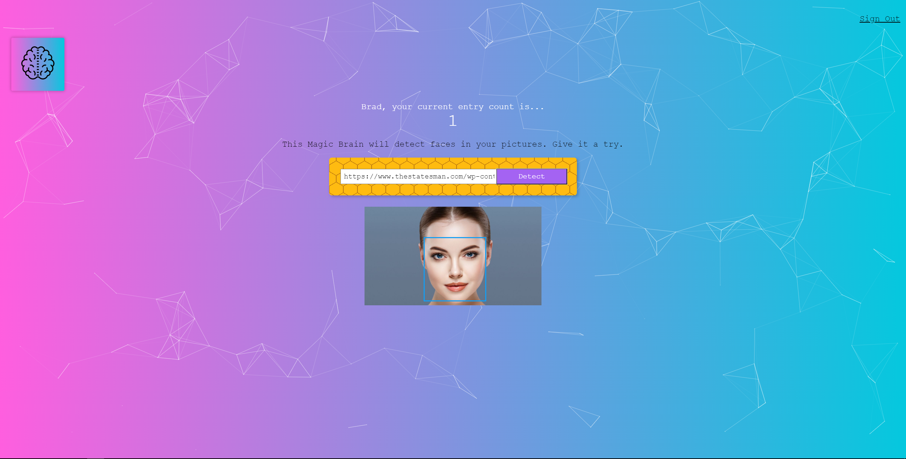

# Smart Brain

Smart Brain is a web application that uses the Clarifai API to perform facial recognition on a user submitted image.

The front-end for smart-brain was built using HTML, CSS, JavaSript, React, Tachyons, and Particles.js.

A production version of the app can be accessed using: https://smart-brain-app12.herokuapp.com/

The back-end code can be accessed here: https://github.com/alfeifan/smart-brain-api
